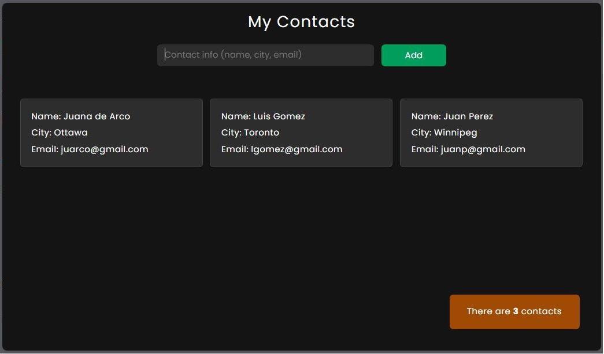

# My Contacts


<br>
[My Contacts](https://fabianmendozaospina.github.io/contacts/) is a learning project developed with `HTML5`, `CSS3`, and `JavaScript (ES6)`. This project showcases how to interact with and manipulate the Document Object Model (DOM) to build a simple contact management interface. It serves as a hands-on demonstration of core web development concepts like JavaScript classes, DOM manipulation, event handling, and basic front-end design.

## Features

[My Contacts](https://fabianmendozaospina.github.io/contacts/) website is designed to showcase modern web development techniques, ensuring both aesthetic appeal and functional responsiveness. Built using best practices in `HTML5` and `CSS3`, and `JavaScript (ES6)`. The following features highlight key aspects of the design:

- Use of semantic HTML tags for better structure and accessibility.
- A responsive web layout through the use of Flexbox, a one-dimensional layout system to align items in rows or columns.
- Utilizing JavaScript to add interactive features, such as dynamically inserting objects into the DOM.
- JavaScript classes are used as models for creating these objects before they are added to the DOM, as well as for their subsequent deletion.

## Get Started

To get started locally:

1. Clone this repo:
   ```bash
   git clone https://github.com/fabianmendozaospina/contacts.git
   cd contacts
   ```
1. Explore the different files.
1. Select the index.html file.
1. Do right-click and select the `Reveal in File Explorer` menu.
1. Double-click on file index.html.
1. The browser will show the starting web page:

   


